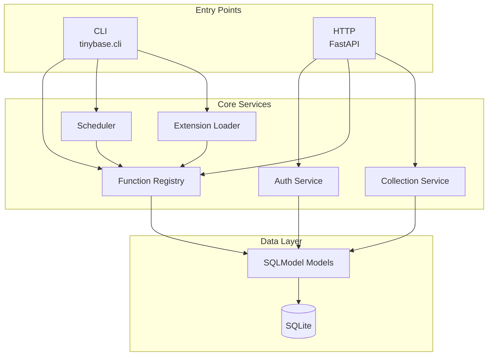
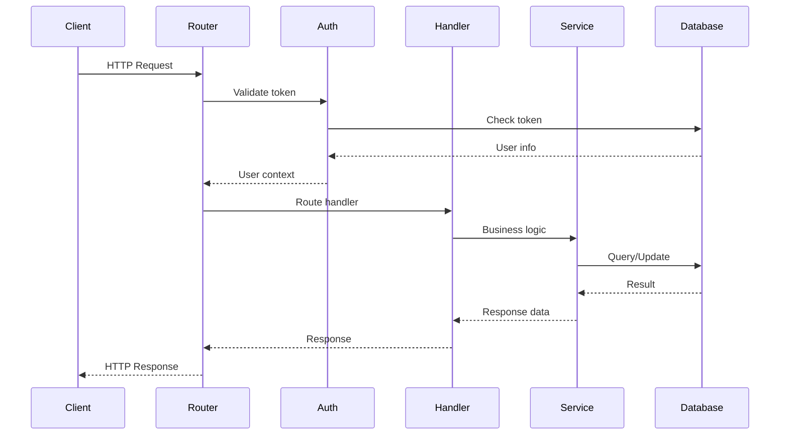
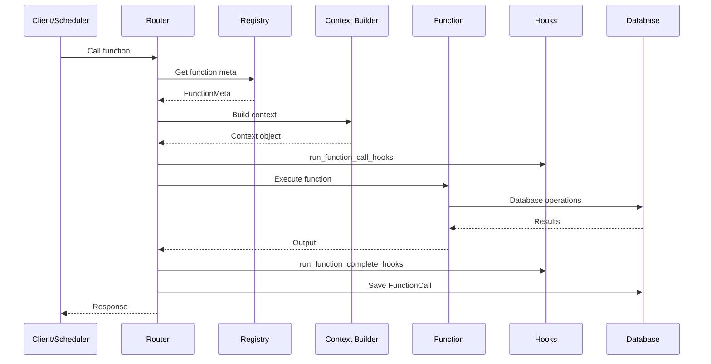
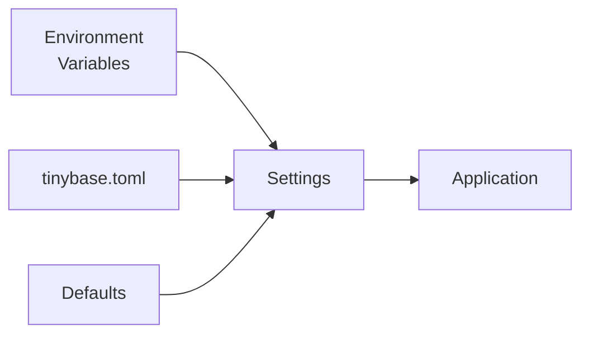

# Architecture

This document describes the internal architecture of TinyBase.

## Overview



## Component Breakdown

### Entry Points

#### CLI (`tinybase/cli/`)

The command-line interface built with Typer, organized as a subpackage:

```text
tinybase/cli/
├── __init__.py      # App assembly and entry point
├── utils.py         # Shared helper functions
├── main.py          # Core commands (version, init, serve)
├── functions.py     # Functions commands (new, deploy)
├── db.py            # Database commands (migrate, upgrade, etc.)
├── admin.py         # Admin commands (add)
└── extensions.py   # Extensions commands (install, list, etc.)
```

Commands:

- `init` - Initialize TinyBase instance
- `serve` - Start the server
- `functions new` - Generate function boilerplate
- `db migrate/upgrade` - Database migrations
- `admin add` - Create admin users
- `extensions install/list` - Manage extensions

#### HTTP Server (`tinybase/api/`)

FastAPI application serving the REST API:

```
tinybase/api/
├── app.py              # Application factory
└── routes/
    ├── admin.py        # Admin endpoints
    ├── auth.py         # Authentication
    ├── collections.py  # Collection CRUD
    ├── functions.py    # Function execution
    └── schedules.py    # Schedule management
```

### Core Services

#### Authentication (`tinybase/auth/`)

Handles user authentication:

- Password hashing (bcrypt)
- JWT token generation/validation
- User role checking
- FastAPI dependency injection

```python
# Key functions
def hash_password(password: str) -> str
def verify_password(password: str, hash: str) -> bool
def create_auth_token(user: User, session: Session) -> tuple[AuthToken, str]
def get_token_user(token: str, session: Session) -> User | None
```

#### Function Registry (`tinybase/functions/`)

Manages registered functions:

```
tinybase/functions/
├── __init__.py         # Public exports
├── context.py          # Context model
├── core.py             # FunctionMeta, Registry
├── loader.py           # Load functions from files
└── register.py         # @register decorator
```

**Key Classes:**

- `FunctionMeta` - Metadata for a registered function
- `FunctionRegistry` - Global registry of functions
- `Context` - Execution context

**Flow:**

1. Functions decorated with `@register`
1. Metadata stored in registry
1. Loader discovers and imports function files
1. Routes dynamically generated from registry

#### Collection Service (`tinybase/collections/`)

Manages dynamic collections:

```
tinybase/collections/
├── __init__.py
├── schemas.py          # Schema → Pydantic model
└── service.py          # CRUD operations
```

**Schema Processing:**

1. JSON schema defined for collection
1. `build_pydantic_model_from_schema()` generates Pydantic model
1. Model used for validation on create/update
1. Models cached in registry

#### Scheduler (`tinybase/schedule/`)

Background job execution and schedule management:

```text
tinybase/schedule/
├── __init__.py      # Public exports
├── scheduler.py     # Background scheduler service
└── utils.py         # Schedule config models and parsers
```

Features:

- Polls for due schedules
- Executes functions with schedule context
- Updates schedule metadata (last_run, next_run)
- Schedule configuration models (once, interval, cron)

```python
async def run_scheduler():
    while True:
        due_schedules = get_due_schedules()
        for schedule in due_schedules:
            await execute_scheduled_function(schedule)
        await asyncio.sleep(interval)
```

#### Extension System (`tinybase/extensions/`)

Plugin architecture:

```
tinybase/extensions/
├── __init__.py         # Public exports
├── hooks.py            # Hook decorators and registry
├── installer.py        # Install from GitHub
└── loader.py           # Load extension modules
```

**Hook System:**

1. Extensions define handlers with `@on_*` decorators
1. Handlers registered in global registries
1. Core code calls `run_*_hooks()` at appropriate points
1. Handlers receive event data

### Data Layer

#### Models (`tinybase/db/models.py`)

SQLModel models:

```python
class User(SQLModel, table=True):
    id: UUID
    email: str
    password_hash: str
    is_admin: bool
    ...

class Collection(SQLModel, table=True):
    id: UUID
    name: str
    schema_: dict  # JSON column
    ...

class Record(SQLModel, table=True):
    id: UUID
    collection_id: UUID
    owner_id: UUID | None
    data: dict  # JSON column
    ...

class FunctionCall(SQLModel, table=True):
    id: UUID
    function_name: str
    status: str
    duration_ms: int
    ...

class FunctionSchedule(SQLModel, table=True):
    id: UUID
    function_name: str
    schedule: dict  # JSON column
    ...
```

#### Database Core (`tinybase/db/core.py`)

Engine and session management:

```python
def get_engine() -> Engine
def create_db_and_tables() -> None
def get_session() -> Session  # Dependency
```

### Request Lifecycle



### Function Execution Flow



## Configuration

### Settings Flow



Priority: Environment > TOML > Defaults

### Configuration Class

```python
class Settings(BaseSettings):
    model_config = SettingsConfigDict(
        env_prefix="TINYBASE_",
        env_nested_delimiter="_",
    )

    server_host: str = "0.0.0.0"
    server_port: int = 8000
    db_url: str = "sqlite:///./tinybase.db"
    # ...
```

## Extension Points

### Adding a New Hook

1. Define event data class in `hooks.py`
1. Create global registry
1. Create decorator function
1. Create runner function
1. Call runner from appropriate location

### Adding a New Route

1. Create route file in `tinybase/api/routes/`
1. Define FastAPI router
1. Implement endpoints
1. Register in `tinybase/api/app.py`

### Adding a New Model

1. Define SQLModel class in `tinybase/db/models.py`
1. Create migration: `tinybase db migrate`
1. Apply migration: `tinybase db upgrade`

## Design Principles

### 1. Simplicity

- Single file database (SQLite)
- Minimal dependencies
- Clear, readable code

### 2. Extensibility

- Hook system for events
- Dynamic function registration
- Plugin architecture

### 3. Type Safety

- Pydantic models throughout
- SQLModel for database
- Type hints everywhere

### 4. Python-First

- Familiar patterns for Python developers
- Leverages Python ecosystem (FastAPI, Pydantic)
- No custom DSLs

## Performance Considerations

### SQLite Concurrency

- SQLite has limited write concurrency
- Use WAL mode for better read performance
- Keep transactions short

### Function Execution

- Functions run in the request thread
- Long-running tasks should be scheduled
- Consider async for I/O-bound operations

### Memory Usage

- Collections models cached in memory
- Large result sets should be paginated
- Monitor extension memory usage

## See Also

- [Development Setup](development.md) - Getting started
- [Testing](testing.md) - Test architecture
- [Code Style](code-style.md) - Conventions
