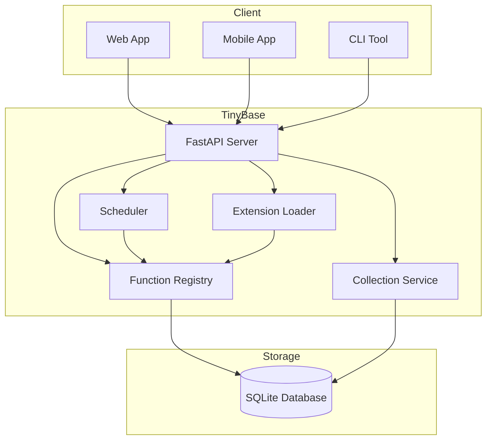
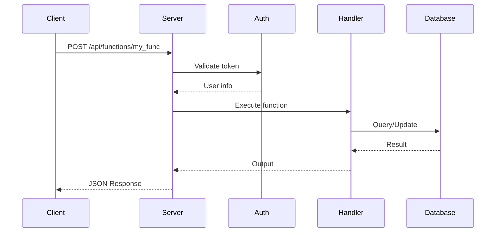

# User Guide

This guide covers all the features of TinyBase in depth. Whether you're building a simple API or a complex application, you'll find everything you need here.

## Core Features

<div class="grid cards" markdown>

-   :material-database: [**Collections**](collections.md)

    Create schema-driven data collections with validation, access control, and CRUD operations.

-   :material-function: [**Functions**](functions.md)

    Build typed server-side functions with Pydantic models, automatic API exposure, and execution tracking.

-   :material-clock: [**Scheduling**](scheduling.md)

    Schedule functions to run once, at intervals, or with cron expressions.

-   :material-shield-account: [**Authentication**](authentication.md)

    User management, token-based auth, and role-based access control.

-   :material-view-dashboard: [**Admin UI**](admin-ui.md)

    Manage your application through a modern web interface.

-   :material-puzzle: [**Extensions**](extensions.md)

    Extend TinyBase with hooks, lifecycle events, and third-party integrations.

</div>

## Architecture Overview



TinyBase is built on these core components:

| Component | Purpose |
|-----------|---------|
| **FastAPI Server** | HTTP handling, routing, OpenAPI |
| **Function Registry** | Stores and executes registered functions |
| **Collection Service** | CRUD operations with schema validation |
| **Scheduler** | Background job execution |
| **Extension Loader** | Loads and manages extensions |
| **SQLite Database** | Persistent storage for all data |

## Request Flow

When a request comes in to TinyBase:

1. **Authentication** - Token is validated (if required)
2. **Routing** - Request is routed to the appropriate handler
3. **Validation** - Input is validated against Pydantic models
4. **Execution** - Business logic runs (function or CRUD operation)
5. **Response** - Result is serialized and returned



## Common Patterns

### Building a REST API

TinyBase excels at building REST APIs. Use collections for data storage and functions for business logic:

```python
# Collections provide automatic CRUD endpoints
# POST /api/collections/posts/records
# GET /api/collections/posts/records
# GET /api/collections/posts/records/{id}
# PATCH /api/collections/posts/records/{id}
# DELETE /api/collections/posts/records/{id}

# Functions add custom business logic
@register(name="publish_post", auth="auth", ...)
def publish_post(ctx: Context, payload: PublishInput) -> PublishOutput:
    # Custom logic here
    ...
```

### Background Processing

Use functions with scheduling for background tasks:

```python
@register(name="process_queue", auth="admin", ...)
def process_queue(ctx: Context, payload: Input) -> Output:
    # Process items from a queue
    ...

# Schedule to run every minute
```

### Webhooks and Integrations

Extensions can hook into events for integrations:

```python
from tinybase.extensions import on_record_create, RecordCreateEvent

@on_record_create(collection="orders")
def notify_order(event: RecordCreateEvent):
    # Send webhook, email, etc.
    send_webhook("https://api.example.com/orders", event.data)
```

## Troubleshooting

### Common Issues

??? question "Server won't start"
    
    1. Check if port 8000 is already in use:
       ```bash
       lsof -i :8000
       ```
    2. Verify your configuration file is valid TOML
    3. Check logs for specific error messages

??? question "Functions not loading"
    
    1. Ensure `functions/` directory exists in your project directory
    2. Check for Python syntax errors:
       ```bash
       python -c "import functions"
       ```
    3. Verify the `@register` decorator is imported correctly

??? question "Database errors"
    
    1. Delete `tinybase.db` and reinitialize:
       ```bash
       rm tinybase.db
       tinybase init
       ```
    2. Check file permissions on the database file
    3. Ensure SQLite is properly installed

??? question "Authentication issues"
    
    1. Verify the token hasn't expired
    2. Check the `Authorization: Bearer <token>` header format
    3. Ensure the user has the required role (admin vs. regular user)

### Debug Mode

Enable debug mode for detailed error information:

```toml
[server]
debug = true
log_level = "debug"
```

Or via environment variable:

```bash
TINYBASE_DEBUG=true TINYBASE_LOG_LEVEL=debug tinybase serve
```

### Getting Help

- **GitHub Issues**: [Report bugs](https://github.com/maximiliancw/tinybase/issues)
- **GitHub Discussions**: [Ask questions](https://github.com/maximiliancw/tinybase/discussions)

## Next Steps

Dive into specific features:

1. [Collections](collections.md) - Start storing data
2. [Functions](functions.md) - Add business logic
3. [Authentication](authentication.md) - Secure your API

